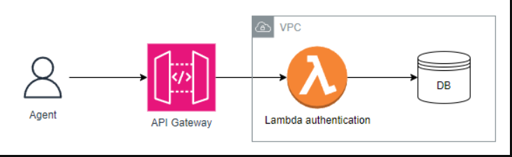
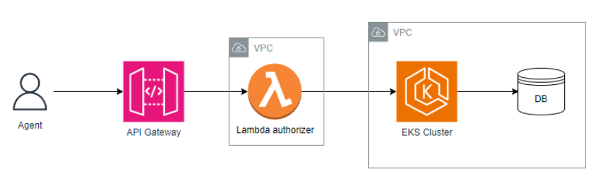
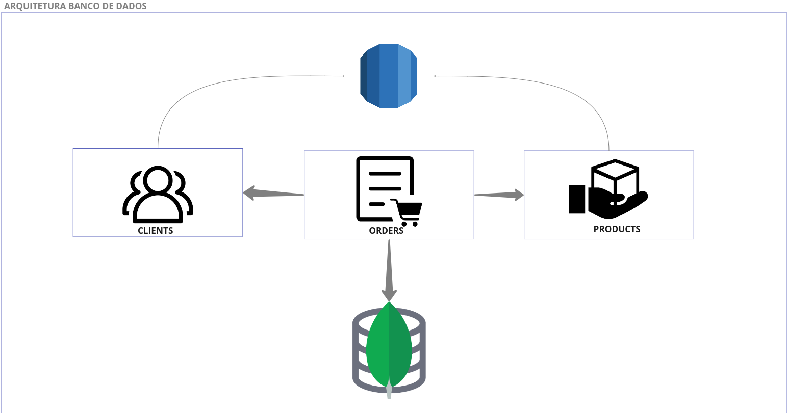
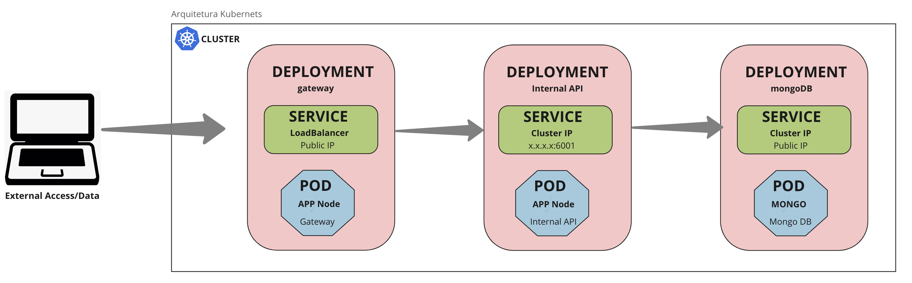

# tech-challenge-fiap
Sistema de Gerenciamento de Pedidos - Fast Food

##  Grupo 33
[Wellington da Silva Alencar](https://github.com/wellalencarweb) | rm353081

[tech-challenge-fiap-fase-03](https://github.com/wellalencarweb/tech-challenge-fiap-fase-03)

[k8s-infra](https://github.com/wellalencarweb/k8s-infra)

[postgres-infra](https://github.com/wellalencarweb/postgres-infra)

[mongo-infra](https://github.com/wellalencarweb/mongo-infra)

[authorization-validator-lambda](https://github.com/wellalencarweb/authorization-validator-lambda)

[Link do Event Storm](https://miro.com/app/board/uXjVNVCMJaU=/?share_link_id=723408841855)

[Link da Documentação da API](http://localhost:6001/api-docs)

[Dockerfile](Dockerfile)

[docker-compose](docker-compose.yml)

# Fase 3 - DISTRIBUIÇÃO DA APLICAÇÃO

## Arquitetura
Os diagramas que se seguem demonstram de forma macro, os fluxos de:
- [autenticação (via CPF)](#ancora1)
- [autorização da aplicação](#ancora2)
- [respositórios](#ancora3)
- [justificativas](#ancora4)

## Autenticação

Quando um agente externo, por exemplo, um site web ou aplicativo, solicita a identificação de um cliente por meio do seu CPF, a função lambda é acionada para autenticar essa solicitação. Essa função lambda é responsável por verificar se o cliente associado ao CPF fornecido existe na base de dados.

Se a verificação for bem-sucedida e o cliente for encontrado na base de dados, a função lambda prossegue para a etapa de geração de token de autenticação. Este token é uma credencial única que será usada para autorizar o acesso às demais rotas ou funcionalidades do sistema.

O token gerado pela função lambda é então retornado ao agente externo (site web ou aplicativo) que fez a solicitação de identificação do cliente. Esse token serve como uma forma de autenticação válida e segura, permitindo ao agente externo acessar e interagir com as rotas protegidas ou funcionalidades específicas do sistema em nome do cliente identificado.

Essa abordagem proporciona uma camada adicional de segurança, garantindo que apenas usuários autorizados, cuja existência foi verificada na base de dados, tenham acesso às funcionalidades do sistema

## Autorização

Após a autenticação bem-sucedida, o token gerado é utilizado para validar se o agente, como um usuário ou serviço, está autorizado a acessar os demais recursos disponíveis na aplicação. No contexto apresentado, esses recursos estão protegidos dentro de uma Virtual Private Cloud (VPC) privada, que não é acessível externamente.

No entanto, para os propósitos práticos deste Tech Challenge (e também como um exercício educacional que não envolve dados sensíveis), optei por manter os acessos como públicos facilitando o desenvolvimento.

## Repositórios:
**[tech-challenge-fiap-fase-03](https://github.com/wellalencarweb/tech-challenge-fiap-fase-03)**: Refere-se à aplicação da lanchonete desenvolvida em node.js para a terceira fase do Tech Challenge. Esta aplicação é responsável por fornecer os recursos necessários para a lanchonete, como gerenciamento de pedidos, estoque de produtos e integração com o cliente.

**[postgres-infra](https://github.com/wellalencarweb/postgres-infra)**: Aqui está a parte da infraestrutura dedicada à administração dos recursos relacionados ao banco de dados PostgreSQL. Isso envolve a configuração e o gerenciamento de instâncias, bancos de dados e tabelas do PostgreSQL, garantindo a persistência segura e confiável dos dados da aplicação.

**[mongo-infra](https://github.com/wellalencarweb/mongo-infra)**: Esta parte da infraestrutura é dedicada à administração dos recursos relacionados ao banco de dados MongoDB. Isso inclui a configuração e o gerenciamento de clusters, bancos de dados e coleções MongoDB, garantindo assim o armazenamento e a recuperação eficientes dos dados da aplicação.

**[k8s-infra](https://github.com/wellalencarweb/k8s-infra)**: Esta parte do projeto é responsável por administrar os recursos Kubernetes relacionados ao Tech Challenge. Isso inclui a configuração e o gerenciamento de pods, serviços, ingressos e outros componentes essenciais para garantir o funcionamento adequado da aplicação em um ambiente Kubernetes.

**[authorization-validator-lambda](https://github.com/wellalencarweb/authorization-validator-lambda)**: Ambiente serverless que engloba a implementação da rota para a geração de tokens de usuário, uma função lambda para autorização e a configuração do API Gateway.

### Justificativa e modelagem dos bancos de dados

**Clientes e Produtos**
Optei por utilizar o banco de dados relacional (Postgres) para armazenar os dados dos clientes e produtos. Essa escolha se baseia no fato de que são dados cadastrais, onde não espero mudanças frequentes na estrutura do esquema (schema), e também porque esses dados podem se relacionar com outras tabelas ou sistemas no futuro, como por exemplo, análises promocionais para clientes ou um sistema de controle de estoque para os produtos.

**Pedidos**
Decidi utilizar o banco de dados não relacional de documentos (MongoDB) para armazenar os dados dos pedidos. Essa escolha se deve à necessidade de flexibilidade no esquema, especialmente porque a parte de pagamento pode envolver diferentes provedores. Além disso, os pedidos representam o núcleo do sistema e provavelmente terão um alto volume de dados. Portanto, é importante que possamos escalar horizontalmente para lidar com essa carga e garantir uma experiência rápida e eficiente para os clientes ao fazerem pedidos ou consultarem o status dos mesmos.

## Cluster EKS
A arquitetura do cluster EKS permanece a mesma conforme descrito na [Fase 2](ttps://github.com/wellalencarweb/tech-challenge-fiap-fase-03)

